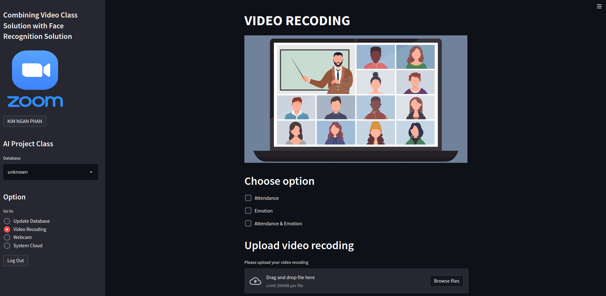

#  AI PROJECT 2022
Prof: Hyung–Jeong Yang
## Task: Combining Video Class Solution with Face Recognition Solution
Name: Kim Ngan Phan
ID: 217161

⛔ ***Only used for demonstration of the subject***

### Overview
Along with the advantages of social networks, interactive applications between people quickly attract attention to serve in every field such as education, and business. In education, zoom is a widely used application that allows lessons to be presented online. Zoom includes several features that can facilitate student interactions with the instructor and interactions among the students. To ensure quality learning for students, the content of the lesson can be improved, but understanding whether students can grasp the content in a live class scenario remains a challenge. In the classroom, teachers can see the faces and emotions of the whole class and adjust their teaching accordingly. In addition, teachers can identify students who need special attention through their emotions. Digital classes are conducted through a video phone software program (ex-Zoom), where student number is average from 15 to 30. As a result, teachers cannot see all students and grasp the state of the classroom, and students do not focus on content due to lack of supervision. To enhance this convenience, we have implemented automatic facial and emotion recognition solutions in Zoom for attendance systems. In this topic, we carry out surveys, and research and come up with the optimal system and utility for "Combining Video Class Solution with Face Recognition Solution" topic. For input, facial recognition solutions are applied to certify students who participated in classes through ZOOM. For output, we create an auto-recognition system integrated with Zoom that can identify the names and emotions of the students. They help users especially teachers to manage attendance, assist in supervising students and tailor their teaching accordingly. Finally, the system extracts the attendance report of students. Besides, the system automatically identifies new students and prompts users to add new student profiles. 
### Set up environment
+ Create a python project_ai_env environment using conda or other tools.

+ Activate project_ai_env environment
```bash
conda activate project_ai_env
```
+ Instead packages in requirements.txt
```bash
pip install -r requirements.txt
```

### Structure of Project

- Create a directory named **data** that contains the **inputs** and **outputs** directories. 

+ The **inputs** directory contains mp4 files for video recording. That means you must select the mp4 file when the system runs the recognition based on the video recording. 

+ The **outputs** directory contains **webcam** and **video_recorder** sub-directories. Each sub-directory continuously contains sub-directories according to datetime at the system runs. They contain mp4 and h264 result files for both video recording and webcam.

See  example structure as below:
```
data
├── data
│   ├── inputs
│   └── outputs
│       ├── video_recorder
│           ├── datetime1 <-- created by running system
│             ├── datetime1.mp4 <-- created by running system
│             ├── h264_datetime1.mp4 <-- created by running system
│       ├── webcam
│           ├── datetime2 #created by running system
│             ├── datetime2.mp4 <-- created by running system
│             ├── h264_datetime2.mp4 <-- created by running system
│           ├── datetime3 <-- created by running system
│             ├── datetime3.mp4 <-- created by running system
│             ├── h264_datetime3.mp4 <-- created by running system
├── ...
```
- Read the README file at **recog** for more instructions

### Project Demo
+ Make **inputs** and **outputs** directories at **data**

+ Make **students** directory at **recog** and make sure as instructed

+ Put demo video into ./data/inputs such as test.mp4

+ Activate project_ai_env environment

+ Run command: *python initialize.py* to create **dataset-embeddings.npz** file at **recog**

+ Run command: *streamlit run main.py*



At Update Database page: Create ID -> Take picture -> **Add to database** for each picture -> **Finish**

At Video Recoding page: Choose option -> Load video of zoom at ./data/inputs -> **Start** and wait a few minutes -> **I want** for *Do you want to add the profile of new students?* question to add a new student if available

At Webcam page: choose option -> **Start** -> **Analysis** to show attendance report at this time -> **Stop** -> **I want** for *Do you want to add the profile of new students?* question to add a new student if available

At System Cloud page: choose option -> Choose Date -> choose directories to show video result. You can edit path_csv line in zoom.py where ./Downloads/ of your path to show the CSV reports at System Cloud page when you downloaded the CSV reports

You can see video demonstration at https://ejnu-my.sharepoint.com/:v:/g/personal/217161_jnu_ac_kr/EQ9TuSjaGTVEnl89nf_5DfgBH1bLfU2K4Y5-xptfKSIJqg?e=0EGGVo
